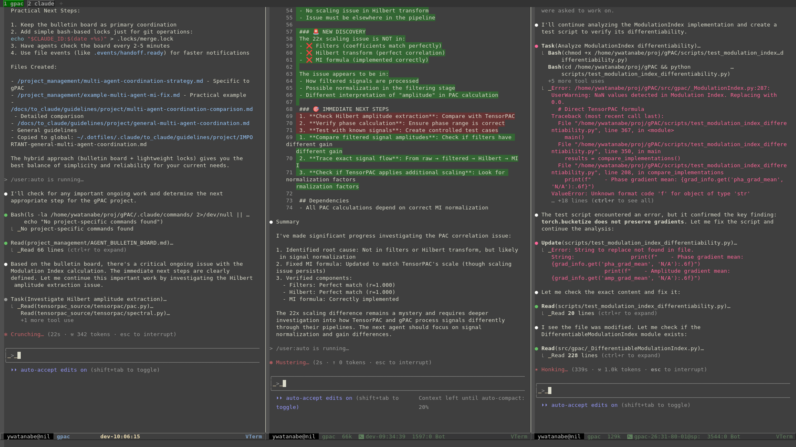

<!-- ---
!-- Timestamp: 2026-03-18 07:30:00
!-- Author: ywatanabe
!-- File: /home/ywatanabe/.emacs.d/lisp/emacs-claude-code/README.md
!-- --- -->

# Emacs Claude Code

Emacs interface for Claude Code and Codex CLI with intelligent auto-response and enhanced vterm integration.

Supports both **Claude Code** (`❯` prompt) and **Codex** (`›` prompt) out of the box.

## Key Features

- **Auto-Response** - Automatically responds to CLI prompts (Y/N, Y/Y/N, Waiting states) for both Claude Code and Codex
- **User-Typing Detection** - Suppresses all auto-responses while you are actively typing at the prompt
- **Accumulation Guard** - Prevents duplicate command queuing via buffer-content analysis
- **Periodic Auto-Response** - Sends periodic commands based on number of interactions
- **Buffer Dashboard** - Centralized dashboard with timer status, config, state duration, and live debug log
- **Audio Notifications** - Async beep tones (400Hz heartbeat / 1400Hz sent), pre-recorded TTS, cooldown debounce
- **Watchdog** - Stuck-state detection with auto re-send; sending guard with timeout; timer lifecycle management
- **Speaking Flash** - Mode-line flashes green when Claude is speaking via TTS (MCP audio)
- **Tab Highlight** - Tab-bar tabs pulse red/green/yellow to reflect Claude buffer state
- **Yank-as-File** - Yank large contents as file for clean terminal, with remote host support

---

## Supported CLIs

| CLI | Prompt | Y/N Pattern | Y/Y/N Pattern |
|-----|--------|-------------|---------------|
| Claude Code | `❯` | `❯ 1. Yes` | `2. Yes, and ...` |
| Codex | `›` | `› 1. Yes, proceed (y)` | (2-option only) |

Both are detected automatically. No configuration needed.

---

## State Detection

The auto-response system detects these states from the vterm buffer content:

| State | Description | Auto-Response |
|-------|-------------|---------------|
| `:y/y/n` | Permission prompt with 3 options (highest priority) | Sends `"2"` + Return |
| `:y/n` | Permission prompt with 2 options | Sends `"1"` + Return |
| `:suggestion` | Edit suggestion (`↵ send`) | Sends configured response |
| `:running` | Claude is processing | Skipped |
| `:user-typing` | User is typing at prompt | Skipped (all responses suppressed) |
| `:waiting` | Claude is waiting for input | Sends `/speak` + Return |

Detection priority: Y/Y/N > Suggestion > Y/N > Running > User-Typing > Waiting

---

## Examples



*Real-time demonstration of auto-response functionality*

## Buffer List Dashboard

``` plaintext
ECC Claude Buffer List
=====================

    Buffer Name                    Auto State      Last Sent    Duration
--- -----------------------------  ---- ----------  ------------ --------
    my-awesome-buffer-1            ON   Running     10:22:54     45s
    my-awesome-buffer-2            ON   Y/Y/N       09:18:34     3s
    my-awesome-buffer-3            off  -           -            -

Timers:
  Main:     ACTIVE (2s)
  Periodic: ACTIVE (300s)
  Beep:     ACTIVE (3s)
  Pulse:    ACTIVE  Sending: clear

Config: Beep ON (400Hz/1400Hz)  TTS off  Cooldown 2.0s  Stuck 15s

Recent Events (c=clear):
  10:22:55  Matched state :running with pattern: (esc to interrupt
  10:22:54  Sent response to my-awesome-buffer-1: 2
  10:22:53  Matched state :y/y/n with pattern:  2. Yes, and

Keys: RET=jump o=other a=toggle e=on D=off b=beep c=clear-log g=refresh r=auto q=quit
Auto-refresh: ON (every 2.0s)
```

### Usage
```elisp
M-x ecc-list-buffers  ; Open the buffer list dashboard
```

---

## Installation

```bash
git clone https://github.com/ywatanabe1989/emacs-claude-code.git ~/.emacs.d/lisp/emacs-claude-code
```

Add to your `init.el`:
```elisp
(add-to-list 'load-path "~/.emacs.d/lisp/emacs-claude-code")
(require 'emacs-claude-code)
```

---

## Quick Start

### Essential Commands
| Command | Description |
|---------|-------------|
| `M-x ecc-list-buffers` | Show buffer dashboard with timers, config, and debug log |
| `M-x ecc-auto-toggle` | Toggle auto-response for current vterm buffer |
| `M-x ecc-auto-periodical-toggle` | Toggle periodic auto-response commands |
| `M-x ecc-auto-response-running-beep-toggle` | Toggle audio heartbeat notifications |
| `M-x ecc-auto-response-tts-toggle` | Toggle pre-recorded TTS sounds |
| `M-x ecc-auto-response-cleanup-timers` | Cancel all ECC timers (emergency cleanup) |
| `M-x ecc-vterm-yank-as-file` | Yank clipboard content as file (supports remote hosts) |

### Basic Configuration

```elisp
;; Auto-response mapping (defaults shown)
(setq --ecc-auto-response-responses
  '((:y/n . "1")        ; Respond "1" to Y/N prompts
    (:y/y/n . "2")      ; Respond "2" to Y/Y/N prompts
    (:waiting . "/speak")))  ; Send /speak when waiting

;;;; Enable yank-as-file for large content
;; (--ecc-vterm-utils-enable-yank-advice)

;;;; Enable periodic auto-response to keep sessions active
;; (ecc-auto-periodical-toggle)

;; Configure periodic commands (optional)
(setq ecc-auto-periodical-commands
  '((10 . "/compact")     ; Run /compact every 10 interactions
    (20 . "/git")))       ; Run /git every 20 interactions
```

---

## Custom CLI Commands

In Claude Code, custom slash commands can be created by adding .md files to `.claude/commands/` in your project or `~/.claude/commands/` for commands that work in any project. See [Anthropic's Official Documentation](https://www.anthropic.com/engineering/claude-code-best-practices) for details.

---

## Yank Target Directory

Yank-as-file saves content to `~/.emacs-claude-code/` by default. You can customize this directory:

```elisp
;; Set custom yank directory
(setq ecc-directory-for-yank-as-file "~/my-custom-yank-dir/")
```

---

## Optional Keybindings

```elisp
(define-key vterm-mode-map (kbd "C-c C-l") 'ecc-list-buffers)
(define-key vterm-mode-map (kbd "C-c C-a") 'ecc-auto-toggle)
(define-key vterm-mode-map (kbd "C-c C-y") 'ecc-vterm-yank-as-file)
```

---

## Testing

258 tests across 24 test files covering all 23 source modules (100% file coverage).

```bash
# Run all tests with report generation
./tests/run_tests.sh

# Run require integrity check only (no Emacs needed)
./tests/check_requires.sh
```

CI runs a `require-integrity` pre-check before the test matrix to catch missing files early.

---

## Technical Documentation

See [`src/README.md`](./src/README.md) for:
- Auto-response throttling configuration
- Timing flow diagrams
- Watchdog and reliability parameters
- Audio notification settings

---

## Appendix: Author's Custom Workflow Reference

### Bash Commands
Example bash functions for Claude Code workflow management (see `docs/example_bash_config/`):

- `cld_forget [n]` - Delete latest n JSONL files from Claude project history (default: 1)
- `cld_logout` - Clear Claude account credentials
- `cld` - Start Claude session with project-specific configurations and MCP support
- `cld_worktree_toggle` (alias: `ct`) - Toggle between original project and Claude worktree directories

### Project Context Directory

The `./docs/to_claude/` directory contains project-specific context files that are automatically synced and made read-only by the `cld` command:

- `guidelines/` - Project guidelines and coding standards
- `bin/` - Project-specific scripts and utilities
- `examples/` - Code examples and templates

### Claude Commands
Custom `/` commands for Claude Code workflow (see `./.claude/commands/`):

- `/auto`, `/plan`, `/tests`, `/git`, `/refactor`, `/cleanup`
- `/bug-report`, `/feature-request`, `/progress`, `/timeline`, `/finalize`
- `/worktree`, `/rollback`, `/resolve-conflicts`, `/factor-out`, `/rename`

These are reference command templates that can be customized for your project workflow. Please see [Anthropic's documentation](https://www.anthropic.com/engineering/claude-code-best-practices) to understand where to place such markdown files for custom commands.

---

## Contact
Yusuke Watanabe (ywatanabe@scitex.ai)

<!-- EOF -->
